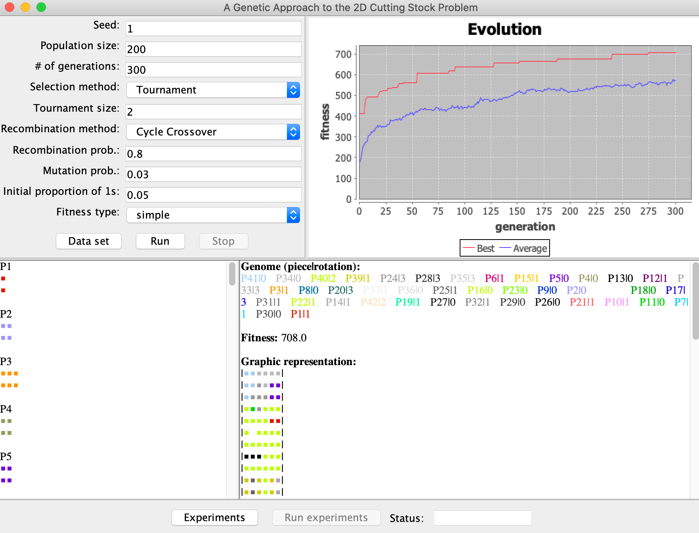
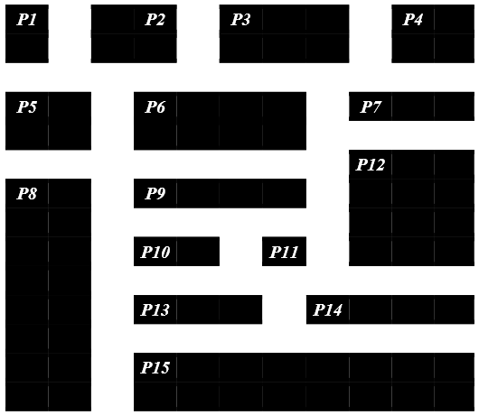
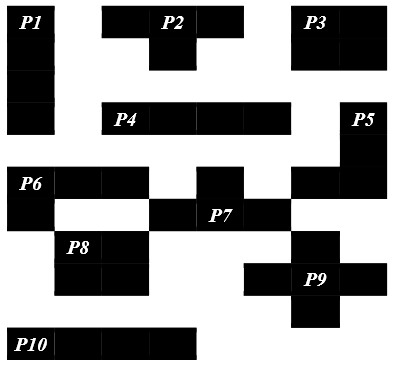
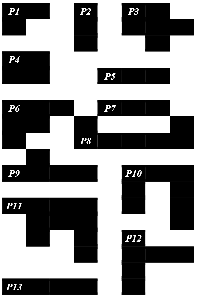
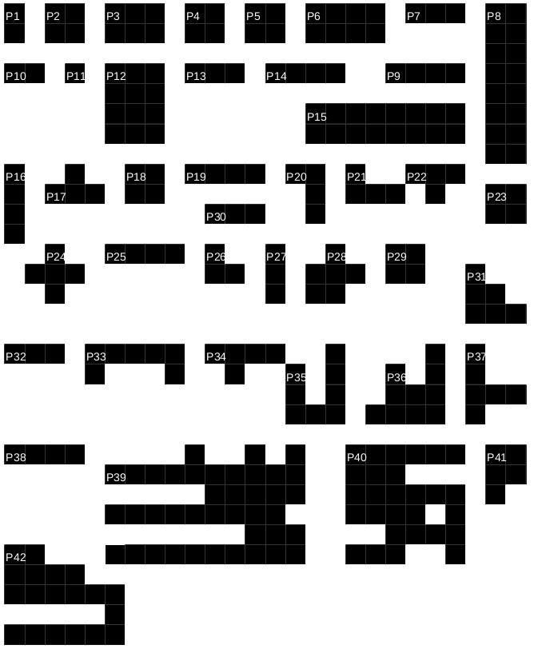

# A Genetic Approach to the 2D Cutting Stock Problem

The cutting stock problem is the problem of cutting certain pieces of stock material into pieces of specified sizes while minimizing the material wasted [[1]](#1-cutting-stock-problem-2015-may-12-in-wikipedia-the-free-encyclopedia-retrieved-1029-may-25-2015-from-httpenwikipediaorgwindexphptitlecutting_stock_problemoldid662064671).

OX (order crossover) and CX (cycle crossover) will be used as genetic operators to solve this kind of problem, comparing their influence on results and make other comparative experiences by mutating genes or changing the values of the population size as the number of generations.

**Keywords:** Two-dimensional cutting stock problem, 2D bin packing, genetic algorithms, artificial intelligence.

### Table of Contents
1. [Population](#population)
  1. [Individuals](#individuals)
2. [Genetic Operators](#genetic-operators)
  1. [Mutation](#mutation)
  2. [OX - Order Crossover](#ox---order-crossover)
  3. [CX - Cycle Crossover](#cx---cycle-crossover)
3. [Fitness Function](#fitness-function)
4. [Computational results](#computational-results)
  1. [Problem 1](#problem-1)
  2. [Problem 2](#problem-2)
  3. [Problem 3](#problem-3)
  4. [Problem 4](#problem-4)
5. [Conclusions](#conclusions)

## Population
The initial population is set after loading the problem data from a text file which contains the maximum length of the stock material and a set of pieces.

Each set of genes will be generated randomly and it contains all pieces of the problem with valid rotations.

### Individuals
An individual is represented by a multidimensional array of pieces and their rotations – 0 (original) to 3 (270º). The table below shows an example of an individual with two genes.

| [Index] | [0]: Number [1]: Rotation | Value |
|:-------:|:-------------------------:|:-----:|
|   [0]   |            [0]            |   1   |
|   [0]   |            [1]            |   0   |
|   [1]   |            [0]            |   2   |
|   [1]   |            [1]            |   3   |

## Genetic Operators
### Mutation
There are two types of possible mutations: 
 * Changing the piece rotation value.
 * Swapping the position of the individual’s genes.

The probability of the occurrence of a mutation must be set manually and it will be compared with a random double for each gene. If the customized value is less than the random one, another random double will be generated. At this point, if the second random double is bigger than the one set manually, the mutation by changing the piece rotation value occurs otherwise two genes will be swapped.

### OX - Order Crossover
In this method, a portion of one parent is mapped to a portion of the other parent. From the replaced portion on, the rest is filled up by the remaining genes, where already present genes are omitted and the order is preserved [[2]](#2-crossover-genetic-algorithm-2014-june-6-in-wikipedia-the-free-encyclopedia-retrieved-1130-may-25-2015-from-httpenwikipediaorgwindexphptitlecrossover_genetic_algorithmoldid611874987) [[3]](#3-order1-crossover-operator-in-rubicite-interactive-retrieved-1642-may-25-2015-from-httpwwwrubicitecomtutorialsgeneticalgorithmscrossoveroperatorsorder1crossoveroperatoraspx).

### CX - Cycle Crossover
Beginning at any gene μ in parent 1, the μ-th gene in parent 2 becomes replaced by it. The same is repeated for the displaced gene until the gene which is equal to the first inserted gene becomes replaced (cycle) [[2]](#2-crossover-genetic-algorithm-2014-june-6-in-wikipedia-the-free-encyclopedia-retrieved-1130-may-25-2015-from-httpenwikipediaorgwindexphptitlecrossover_genetic_algorithmoldid611874987) [[4]](#4-cycle-crossover---cx---genetic-algorithms-2014-november-16-in-youtube-retrieved-1428-may-25-2015-from-httpwwwyoutubecomwatchv85pia2tysus).

## Fitness Function
At the beginning the fitness equals to the length times width of the stock material.

After the stock material matrix was filled with pieces, the fitness value will be decremented with the number of empty cells and the amount of cuts.

Important notes:
 * Each piece is placed the leftmost possible.
 * The best(s) individual(s) must have the biggest fitness value.
 * All stock material lines with only empty cells (line, column) will be ignored.

## Computational results
This section presents the computational results obtained during the experiences to reach the best individual. For each problem, 30 runs were performed, each one starting from seed 1. The conclusions are discussed on [section 5](#conclusions).

### Problem 1
*Stock material length: 6*

|  Best individual |  243 (fitness)  |
|:----------------:|:---------------:|
|       Seed       |        1        |
|  Population size |       100       |
| # of generations |       100       |
| Selection method |    Tournament   |
|  Selection size  |        2        |
|  Recomb. method  | Cycle Crossover |
|   Recomb. prob.  |       0.6       |
|  Mutation prob.  |       0.03      |

### Problem 2
*Stock material length: 5*

|  Best individual |  111 (fitness)  |
|:----------------:|:---------------:|
|       Seed       |        1        |
|  Population size |       100       |
| # of generations |       100       |
| Selection method |    Tournament   |
|  Selection size  |        2        |
|  Recomb. method  | Cycle Crossover |
|   Recomb. prob.  |       0.6       |
|  Mutation prob.  |       0.03      |

### Problem 3
*Stock material length: 5*

|  Best individual |  174 (fitness)  |
|:----------------:|:---------------:|
|       Seed       |        1        |
|  Population size |       100       |
| # of generations |       300       |
| Selection method |    Tournament   |
|  Selection size  |        2        |
|  Recomb. method  | Cycle Crossover |
|   Recomb. prob.  |       0.6       |
|  Mutation prob.  |       0.03      |

### Problem 4
*Stock material length: 6*

|  Best individual |  758 (fitness)  |
|:----------------:|:---------------:|
|       Seed       |        1        |
|  Population size |       200       |
| # of generations |       300       |
| Selection method |    Tournament   |
|  Selection size  |        2        |
|  Recomb. method  | Cycle Crossover |
|   Recomb. prob.  |       0.8       |
|  Mutation prob.  |       0.03      |

## Conclusions
According to the computational global results, we can conclude in terms of crossover techniques that the cycle crossover achieves better results than the order crossover operator. In terms of selection we realize that tournament is a better selective method than the roulette wheel.

The problem [1](#problem-1) have a simple set of pieces thus it is very easy to reach the best individual on the first group of generations.

However the problems [2](#problem-2) and [3](#problem-3) are more complex so we can see relevant differences between the two selective methods and also between the two crossover operators.

Additionally we built [another](#problem-4) problem to evaluate our genetic approach more efficiently. In this last case we noted more differences in selective and crossover operators which proves the first conclusion described on this section.

For future work, maybe using PMX (partially matched crossover) could be more efficiently than CX, by giving better results [[5]](https://github.com/ffsantos92/2d-cutting-stock-problem#5-a-comparative-analysis-of-pmx-cx-and-ox-crossover-operators-for-solving-travelling-salesman-problem-in-international-journal-of-latest-research-in-science-and-technology-vol1-issue-2-page-no-98-101-july--august-2012).

## References
###### [1] Cutting stock problem. (2015, May 12). In *Wikipedia, The Free Encyclopedia*. Retrieved 10:29, May 25, 2015, from http://en.wikipedia.org/w/index.php?title=Cutting_stock_problem&oldid=662064671
###### [2] Crossover (genetic algorithm). (2014, June 6). In *Wikipedia, The Free Encyclopedia*. Retrieved 11:30, May 25, 2015, from http://en.wikipedia.org/w/index.php?title=Crossover_(genetic_algorithm)&oldid=611874987
###### [3] Order1 Crossover Operator. In *Rubicite Interactive*. Retrieved 16:42, May 25, 2015, from http://www.rubicite.com/Tutorials/GeneticAlgorithms/CrossoverOperators/Order1CrossoverOperator.aspx
###### [4] Cycle Crossover - CX - Genetic Algorithms. (2014, November 16). In *YouTube*. Retrieved 14:28, May 25, 2015, from http://www.youtube.com/watch?v=85pIA2TYsUs
###### [5] A Comparative Analysis of PMX, CX and OX Crossover operators for solving Travelling Salesman Problem. In *International Journal of Latest Research in Science and Technology*. Vol.1, Issue 2: Page No. 98-101, July-August (2012).

---

## License
See the LICENSE file for license rights and limitations (MIT).
